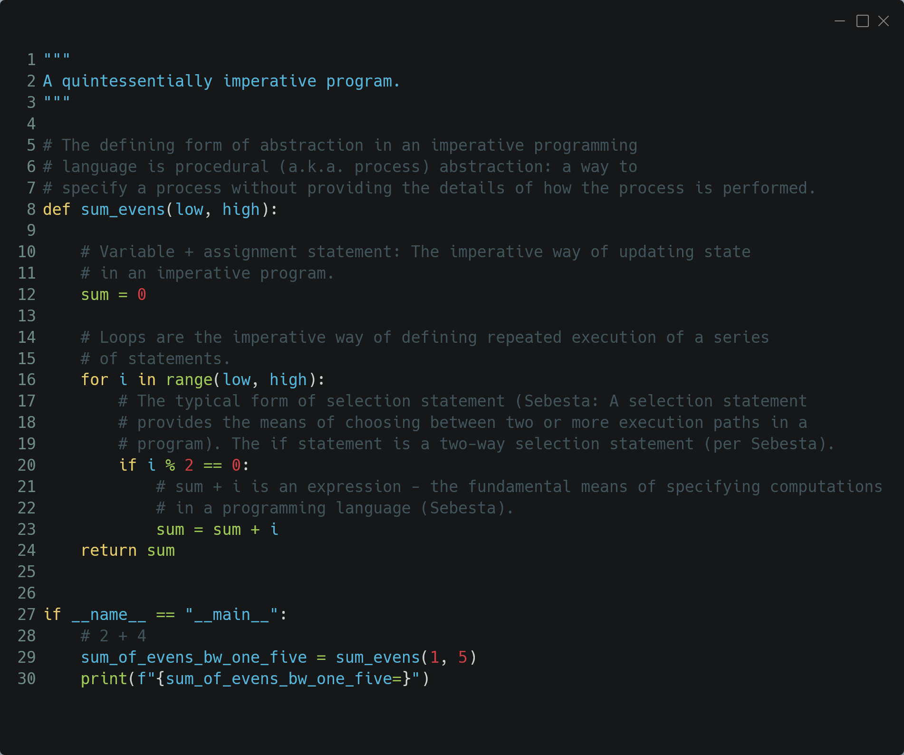
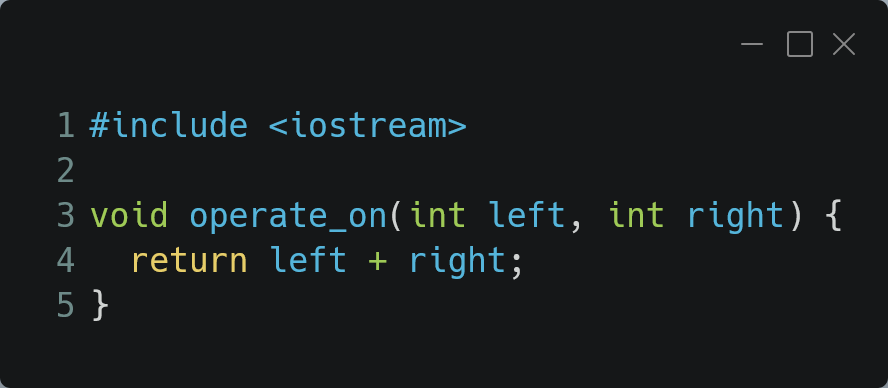
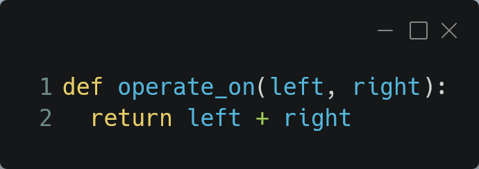

# The Daily PL - Introduction to Imperative, Variables, Binding

Today brings to your porch another edition of the Daily PL! Enjoy the
read!

### What's News

Making headlines today is a more complete definition of *imperative
programming languages* and a complete enumeration/study of the defining
characteristics of *variables.* A new report by the Binding For America
PAC is out that says informed citizens demand to know more about
when/how attributes are associated with entities. Finally, we'll speak
to a reporter about what's really on everyone's mind: Just *when* is it
okay to get my first Pumpkin Spice Latte of the year!

### Imperative Programming Languages

Any language that is an abstraction of the von Neumann Architecture can
be considered an imperative programming language.

There are 5 calling cards of imperative programming languages:

1.  *state*, *assignment* *statements*, and *expressions*: Imperative
    programs have state. Assignment statements are used to modify the
    program's state using values computed from expressions.
    1.  *state*: The contents of the computer's memory as a program
        executes.
    2.  *expression*: The fundamental means of specifying a computation
        in a programming language. As a computation, they produce a
        value.
    3.  *assignment statement:* A statement with the semantic effect of
        destroying a previous value contained in memory and replacing it
        with a new value. The primary purpose of the assignment
        statement is to have a side effect of changing values in memory.
        As Sebesta says, "The essence of the imperative programming
        languages is the dominant role of the assignment statement."
2.  *variables*: The abstraction of the memory cell in the von Neumann
    architecture.
3.  *loops:* Iterative form of repetition (for, while, do ... while,
    foreach, etc)
4.  *selection statements*: Conditional statements (if/then, switch,
    when)
5.  *procedural abstraction*: A way to specify a process without
    providing details of how the process is performed. The primary means
    of procedural abstraction is through the definition of *subprograms*
    (functions, procedures, methods).

To get our eyes used to seeing each of these components in the wild,
let's look at an annotated piece of quintessentially imperative code:

(as with all examples, you can find this source code online in the
class' git repository:
<a href="https://github.com/hawkinsw/cs3003/tree/main/paradigms"
class="external" target="_blank"
rel="noreferrer noopener">https://github.com/hawkinsw/cs3003/tree/main/paradigms</a>)

### Variables

There are 6 *attributes* of *variables*. Remember, though, that
fundamentally a variable is an abstraction of a memory cell.

1.  *type*: Collection of a variable's valid data values and the
    collection of valid operations on those values.
2.  *name*: String of characters used to identify the variable in the
    program's source code.
3.  *scope*: The range of statements in a program in which a variable is
    visible.
    - Using the yet-to-be-defined concept of *binding*, there is an
      alternative definition: The range of statements where the name's
      binding to the variable is active.
4.  *lifetime*: The period of time during program execution when a
    variable is associated with computer memory.
5.  *address*: The place in memory where a variable's contents (value)
    are stored. This is sometimes called the variable's *l-value*
    because only a variable associated with an address can be placed on
    the *left* side of an assignment operator.
6.  *value*: The contents of the variable. The value is sometimes call
    the variable's *r-value* because a variable with a value can be used
    on the *right* side of an assignment operator.

### Looking forward to Binding

A *binding* is an association between an *attribute* and an *entity* in
a programming language. For example, you can *bind* an operation (the
attribute) to a symbol (the entity): the addition operation can be bound
to the `+` symbol.

*Binding* can happen at various times:

1.  Language design (when the language's syntax and semantics are
    defined or standardized)
2.  Language implementation (when the language's compiler or interpreter
    is implemented)
3.  Compilation (when the program is compiled \[note: This "time" is not
    applicable for all languages\])
4.  Linking (when all modules of compiled code for a program are
    collected into a complete, executable program)
5.  Loading (when a program \[either compiled or interpreted\] is loaded
    into memory)
6.  Execution

A *static binding* occurs before runtime and does not change throughout
program execution. A *dynamic binding* occurs at runtime and/or changes
during program execution.

Notice that the six "things" we talked about that characterize variables
*are actually attributes*!! In other words, those attributes have to be
bound to variables at some point. When these bindings occur is important
for users of a programming language to understand. We will discuss this
further next class.

To get you thinking about the next class, think about the following:

We talked above about the + operator being an entity and, therefore,
having a set of characteristics. In the example, we said that the
operation (the characteristic) could be mathematical addition. However,
that's not always the case, is it? In Python, sometimes the + can be
used to execute a string concatenation. Here is a C++ and a Python
snippet that both use the + operator. Consider the difference in the
binding times of the operation to the symbol for the two languages!

C++

Python

