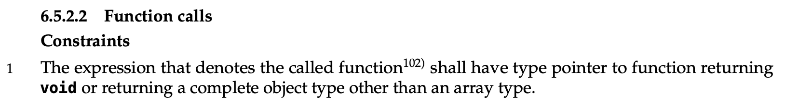
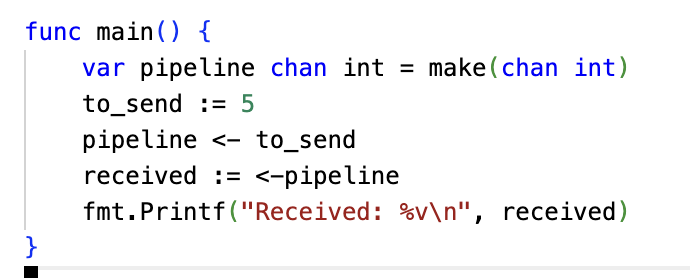

# The Daily PL - Language Evaluation Criteria

## What's News

Long a nemesis of non-Power 5 Conference teams, the college football
playoff committee has decided to expand their criteria for who can make
the playoff. Analysts believe that including a readability, writeability
and reliability assessment will especially help a school like the
University of Cincinnati. If possible, the Bearcats look better under
the microscope of these added criteria than they do on the field. Go
Cats!

### Language Evaluation Criteria

There are four (common) criteria for evaluating a programming language.
We talked about three of them in class:

*Readability* is a metric for describing how easy/hard it is to
comprehend the meaning of a computer program written in a particular
language, *without running* *it*. The most thorough study to date about
the daily activities of computer programmers shows that

> on average program comprehension takes up \~58 percent of \[our\] time
> <a href="https://ieeexplore-ieee-org.uc.idm.oclc.org/document/7997917"
> class="external" target="_blank" rel="noreferrer noopener">[1]</a>.

If we spend *that* much time doing something, it must be important.

In a sense, *writeability*, the second evaluation criteria, is the
complement to readability. Writeability is how/easy or hard it is to
create programs for a particular domain in a particular programming
language. Take note that writeability is a way to analyze a particular
language in the *context of a particular domain*. If you evaluate the
writeability of the same programming language, say JavaScript, in the
context of writing web applications you will score the language
differently than you would if you evaluated its writeability in the
context of writing climate-modeling software.

Finally, the third criteria that we discussed in class was
*reliability*. Because the software that we write will continue to be
used long after we have finished writing it (if we are lucky enough to
write software that people use!), it is important that it works
correctly even long after we stop paying attention to it. What's more,
these days it is vital that our software is correct because we are
beginning to rely on it to protect our safety! Specifically, the
reliability of a programming language is the extent to which a program
written in that language performs according to its specifications under
all conditions.

As a bonus, it is possible to consider the *cost* of a programming
language. To evaluate the cost of a programming language we will have to
broaden our perspective a bit. We will have to include the cost of
training programmers to use that language, the cost of each execution of
the program (think about it, executing a program is not free), the cost
of maintaining and updating the program if it has poor reliability or
does not include all the features that users desire.

### A Language's Mannerisms (Check out that sophisticated vocabulary!)

Several characteristics of programming languages can be used to score it
according to the criteria above. A language's *overall simplicity* is
based upon the number of basic concepts that it has. *Feature
multiplicity* (<a
href="https://en.wikipedia.org/wiki/There%27s_more_than_one_way_to_do_it"
class="external" target="_blank" rel="noreferrer noopener">having
more than one way to accomplish the same thing)</a> decreases a
language's overall simplicity. *Operator overloading* (when operators
perform different computation depending upon the context (e.g., the type
of its operands)) also decreases the simplicity of a language. Before
you get carried away thinking that a language should pursue simplicity
at all costs, think about the most simplistic language you can imagine
and then decide if you want to write
<a href="http://www.chrissawyergames.com/faq3.htm" class="external"
target="_blank" rel="noreferrer noopener">industrial-strength
programs in assembler!</a> A language's overall simplicity plays
a role in its readability (positive, for the most part), writeability
(also positive) and reliability (again, positive).

The presence/absence of type information for variables in a programming
language can also play a role in how readable/writeable/reliable a
program written in that language is. Types are a way to limit/detect
invalid operations on, or invalid values of, variables. *NB*: We are
going to learn a more precise definition of types in a future lecture --
stay tuned -- but this definition will do for now. That said, type
information does not prevent all mistakes. Nor are types always a good
thing. Having to write the type of every variable can cause finger
fatigue and make it harder to *write* code. Types positively impact a
language's readability and reliability but (can) negatively impact a
language's writeability.

The next characteristic is a little tricky. *Orthogonality* is all about
how regularly (ie, normally, without exception) operations in a
programming language interact with one another. (Alternate definition:
The mutual independence of a programming language's primitive
operations.) The definition is a little verbose, so let's conjure up
some examples. It would seem like a good idea for a language to support
return values from functions that can be of *any* type the language
supports. So, if you had a language that allowed you to have variables
that are integers, if it were orthogonal you would be able to return
integers from functions. The same for doubles. And even composite types
like arrays, if the language supported them! In C, what can you `return`
from a function? An `int`? Check. A `float`? `double` (see what I did
there?) check. Well, what about an array? Bzzzz. Nope. What we just
experienced is an example of a piece of C's syntax that is
non-orthogonal. What you can probably surmise from this example is an
important corollary to the amount of orthogonality in a programming
language: As the orthogonality of a programming language decreases, the
number of *exceptions to the rule* increases. *Exceptions to the
rule *look like what we just saw. In a highly orthogonal language, the
rule would be as succinct as:

> You can return a variable of any type from a function.

Too bad we have to make it clunkier when talking about C  by adding
caveats (the *exceptions*):

> ... except functions and arrays.

Before you think that these things don't actually matter, let me
reassure that they exist in real life:

Be careful, though. There is a Dr. Jekyll lurking: The more orthogonal a
language, the slower it is: The compiler/interpreter must be able to
compute based on every single possible combination of language
constructs. If those combinations are restricted, the compiler can make
optimizations and assumptions that will speed up program execution. The
orthogonality of a language plays a part in determining how readable,
writeable and reliable a program written in a given language is.

And, because we are on a roll, let's explore a bonus characteristic that
we did not talk about in class today: a language's syntax. Ideally a
language's reserved words should be elucidating and not obscuring. For
instance, it is easier to match the beginnings and endings of loops in a
language that uses names rather than { }s. Moreover, the language's
syntax should evoke the operation that it is performing.

Go has a really neat mechanism for facilitating communication between
cooperating threads of execution. In Go, a
<a href="https://go.dev/tour/concurrency/2" class="external"
target="_blank"
rel="noreferrer noopener"><em>channel</em></a> is a two-way
communication, well, channel. What someone sends on a channel can be
read by someone on the other side. Intuitive, right? As you can see
above, the designers of Go chose to use `<-` as the sigil to indicate an
action on a channel and it always points at the target of a channel
operation. To send a value to a channel, you point the `<-` at the name
of the channel. To read from a channel, you point the `<-` at the
variable where the value will be stored. Or, to put it simply (as they
do in the Go documentation), "\[T\]he data flows in the direction of the
arrow." It just *feels* obvious.

Here's another example: A `+` should perform some type of addition
operation (mathematical summation, concatenation, etc) and should *not*
calculate, say, the dot product of its operands. I would argue that a
syntax designed for readability and reliability will decrease a
language's writeability. Anyone willing to challenge me on that? I'd
love to hear what you think!

<a href="https://ieeexplore-ieee-org.uc.idm.oclc.org/document/7997917"
class="external" target="_blank" rel="noreferrer noopener">[1] X.
Xia, L. Bao, D. Lo, Z. Xing, A. E. Hassan and S. Li, "Measuring Program
Comprehension: A Large-Scale Field Study with Professionals," in IEEE
Transactions on Software Engineering, vol. 44, no. 10, pp. 951-976, 1
Oct. 2018, doi: 10.1109/TSE.2017.2734091.</a>

