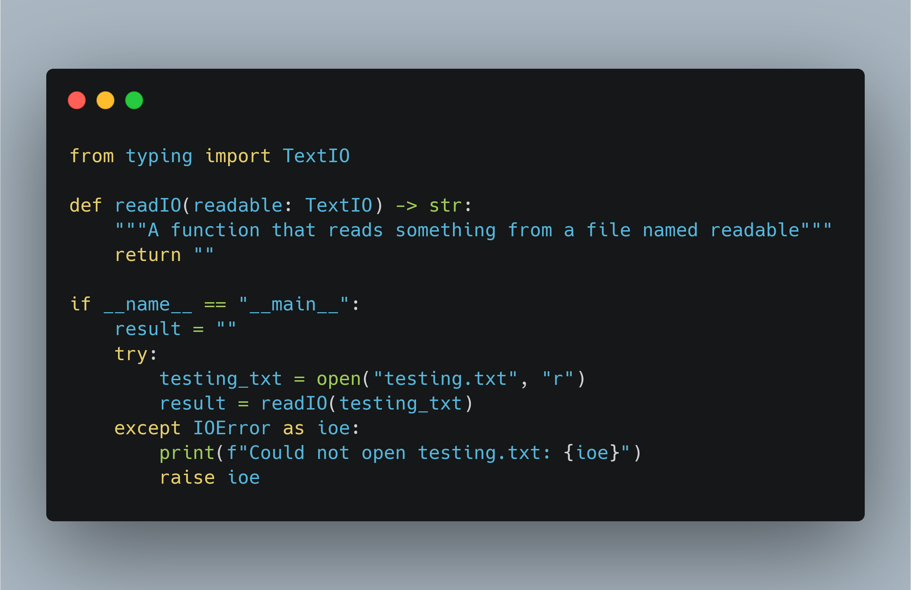
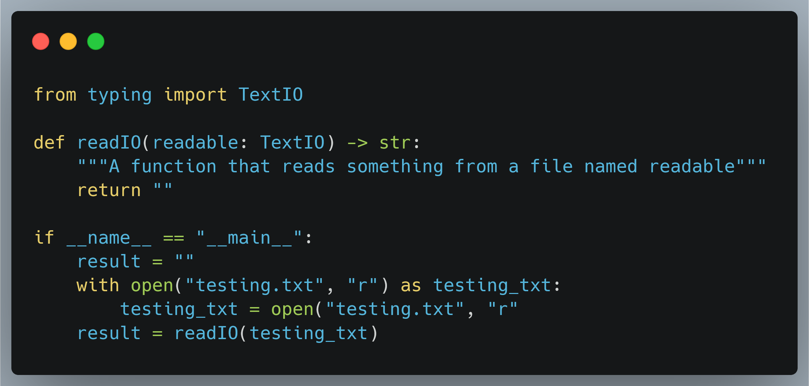

# The Daily PL - Value of Studying PL

## What's News

In the headlines today, last night's debate was certainly entertaining,
with candidates getting combative. Who won? Viewers decided that the
winner is always the language best suited for the use case!

### The Value of Studying Programming Languages

Every new language that you learn gives you new ways to think about and
solve problems. There is a parallel here with natural languages. Certain
written/spoken languages have words for concepts that others do not.
Linguists have said that people can only conceive ideas for which there
are words.

The same is true in programming languages. In certain languages there
may be constructs ("words") that give you a power to solve problems and
write algorithms in new, interesting ways. Having studied (broadly)
programming languages, you will know these constructs and be able to
deploy them appropriately to solve a given problem.

With a broad and complete knowledge of programming languages, you are
equipped with the power to choose the right tool for the job. When all
you have is a hammer, everything looks like a nail.

Knowing about myriad programming languages makes you an increasingly
flexible programmer. In fact, the more you know about the concepts of
programming languages (and how those concepts are embedded in the PLs
that you know) the easier it is to learn new languages.

Finally, studying PLs will give you the ability to use the languages you
know in better ways. Consider Python code that performs the task of
opening a file and reading its contents. You want the code to be robust
and worry that the file the user specifies is not available, so you use
a `try ... except` block:

Well, that's great, but it is a little verbose. As PL pros, you would
look at the situation and realize that there must be a better way.
Indeed there is:

Not only will you learn how to better *use* the languages you know on
the *syntactic* level, you will also get a sense for how to leverage
their *semantics* and take advantage of the language's implementation. 
This "awareness" can give you insight into the "right way" to do
something in a particular language. For example, if you know that
recursion and looping are equally performant and computationally
powerful, you can choose to use the combining form (a term that I
misappropriated from a paper by John Backus \[that you will read later
in the semester\] and use \[incorrectly\] to describe patterns or forms
in programming languages that allow sequences of statements to be
combined. *e.g.* `for`, `while`, `if ... else`) that improves the
readability of your code. However, if you know that iteration is faster
(and speed is important for your application) then you will choose
*that* method for invoking statements repeatedly.

### Programming Domains

We do not write programs in a vacuum -- we write them to solve
real-world problems.

The problems that we are attempting to solve lend themselves to
solutions in particular programming languages with certain
characteristics. Some of those real-world problems are meta (no, not
*that*
<a href="https://about.facebook.com/" class="external" target="_blank"
rel="noreferrer noopener">meta</a>) because they are all
about helping others solve their real-world problems. The solutions to
these problems are known as systems programs and include operating
systems, utilities, compilers, interpreters, drivers, servers, etc.
There are a number of good languages for writing these applications: C,
C++, Rust, Python, Go, etc. Languages used to write systems software
need to be fast, safe and allow access to the underlying hardware, to
name a few of the requirements.

However, most of programs that are written are designed/written to solve
*actual* real-world problems:

- scientific calculations: these applications need to be fast
  (parallel?) and mathematically precise (work with numbers of many
  kinds). Scientific applications were the earliest programming domain
  and inspired the first high-level programming language, Fortran.
- artificial intelligence: AI applications manipulate symbols (in
  particular, lists of symbols) as opposed to numbers. This application
  requirement gave rise to a special type of language designed
  especially for manipulating lists, Lisp (List Processor).
- world wide web: WWW applications must embed code in data (HTML).
  Because of how WWW applications advance so quickly, it is important
  that languages for writing these applications support rapid iteration.
  Common languages for writing web applications are PERL, Python,
  JavaScript, Ruby, Go, etc.
- business: business applications need to produce reports, process
  character-based data, describe and store numbers with specific
  precision (aka, decimals). COBOL has traditionally been the lingua
  franca of business application developers, although new business
  applications are being written in other languages these days (Java,
  the .Net languages). 
- machine learning: machine learning applications require sophisticated
  math and algorithms and most developers do not want to rewrite these
  when good alternatives are available. For this reason, a language with
  a good ecosystem of existing libraries makes an ideal candidate for
  writing ML programs (Python, Julia, Mojo).
- game development: So-called AAA games must be fast enough to generate
  lifelike graphics and immersive scenes in near-real time. For this
  reason, games are often written in a language that is expressive but
  generates code that is optimized, C++.

This list is non-exhaustive, obviously!

